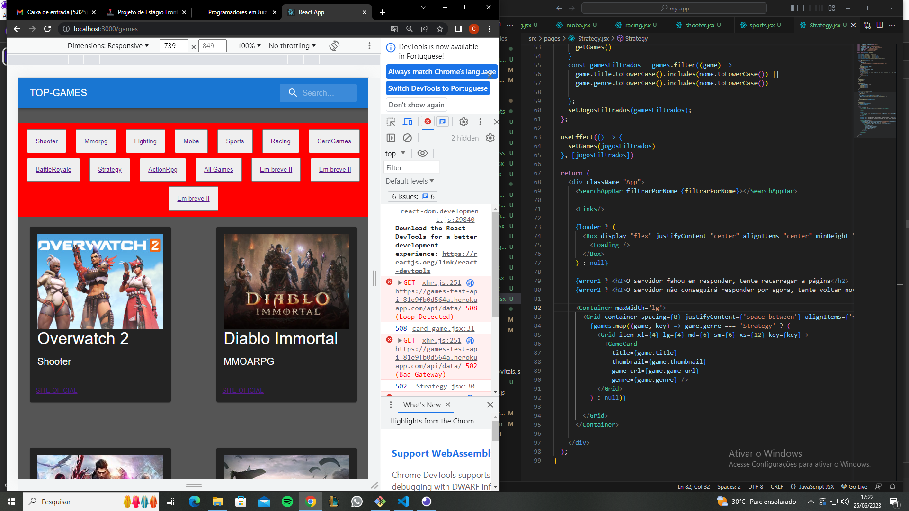
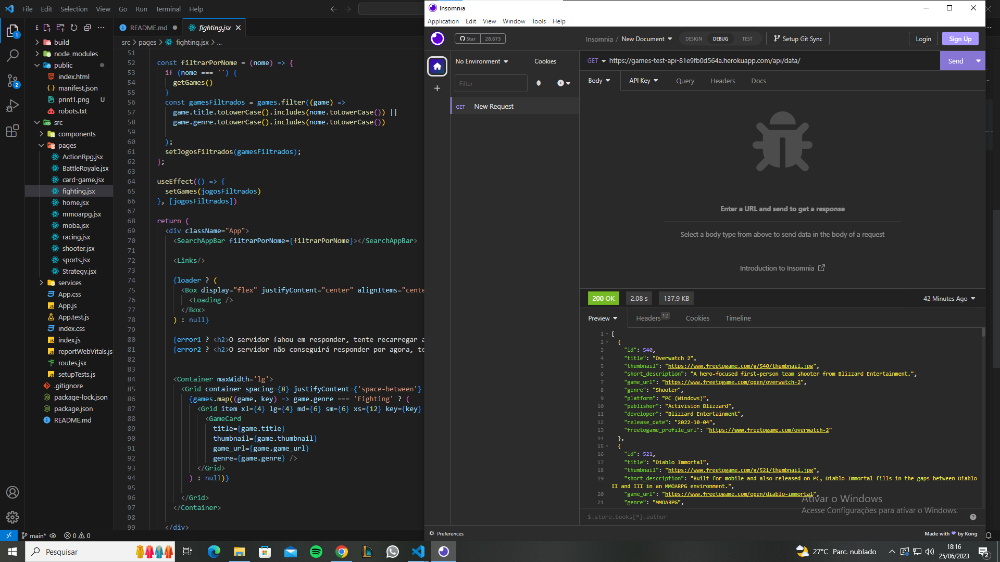
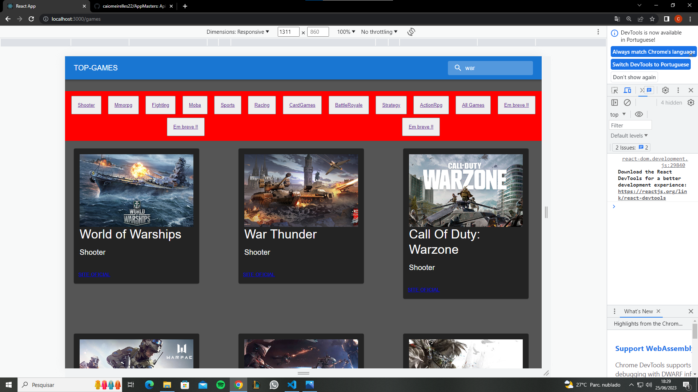

 

<!-- Atenção especial ao print3, onde mostra o filtro funcionando
   link do projeto local: http://localhost:3000/games
   link do projeto remoto: https://caiomeirelles22.github.io/apiGames
 -->
